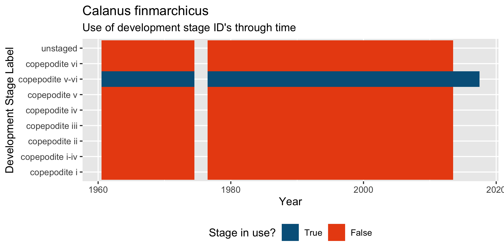
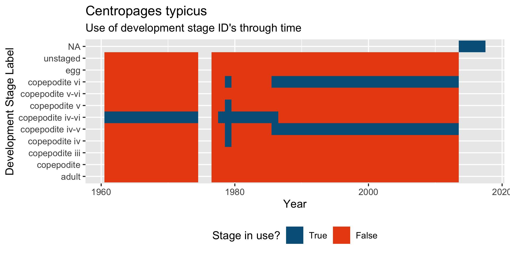
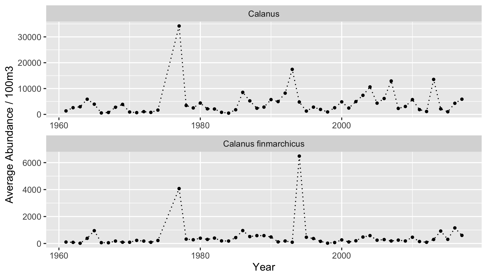

<!-- README.md is generated from README.Rmd. Please edit that file -->

# Building One Continuous Time Series

As mentioned in the top-level README, slight differences in units and
development stage classifications prevent a direct join of Gulf of Maine
CPR data collected & stored by NOAA and its parallel data that is
obtained from the Marine Biological Association (MBA).

## Loading NOAA and MBA Data

The data reshaping steps for working with these two data sources can be
shown using data directly from ERDDAP.

For user-convenience these steps have been detailed below:

**Necessary R Packages**

``` r
library(targets)   # For loading data from targets workflow
library(tidyverse) # Data manipulation
library(rerddap)   # Accessing Data using ERDDAP API
library(worrms)    # Interface with WORMS and Aphia ID's

# helper for selecting thins "not in" a vector
`%nin%` <- function(x, table){ is.na(match(x, table, nomatch = NA_integer_))}
```

**Working from the {targets} pipeline**

``` r
# Paths to targets instead of ERDDAP

# NOAA Sourced Years
withr::with_dir(rprojroot::find_root('_targets.R'),         
                tar_load("noaa_zp_erddap"))
# withr::with_dir(rprojroot::find_root('_targets.R'),         
#                 tar_load("noaa_phyto_erddap"))


# MBA Sourced Years
withr::with_dir(rprojroot::find_root('_targets.R'), 
                tar_load("mba_zpe_erddap"))
withr::with_dir(rprojroot::find_root('_targets.R'), 
                tar_load("mba_zpt_erddap"))


# Reformat data types for later
noaa_zp <- noaa_zp_erddap %>% 
  mutate(
    transect_number = as.character(transect_number),
    abundance = as.numeric(abundance))


# Shorten MBA names
mba_zpt <- mba_zpt_erddap
mba_zpe <- mba_zpe_erddap


# Toss the original targets
rm(noaa_zp_erddap, mba_zpt_erddap, mba_zpe_erddap)
```

**Working from the ERDDAP Uploads**

``` r
# 1. NOAA Zooplankton
# Get the tabledap information from the server link and dataset_id
cpr_info <- info(url = "http://ismn.erddap.neracoos.org/erddap", 
                 datasetid = "noaa_gom_cpr_zooplankton")

# Use the tabledap function to import all the data (optionally add filters)
noaa_zp <- tabledap(cpr_info)

# Reformat data types for later
noaa_zp <- noaa_zp %>% 
  mutate(
    transect_number = as.character(transect_number),
    abundance = as.numeric(abundance))


# 2. MBA Traverse
cpr_info <- info(url = "http://ismn.erddap.neracoos.org/erddap", 
                 datasetid = "mba_gom_cpr_traverse")
mba_zpt <- tabledap(cpr_info)

# 2. MBA Eyecount
cpr_info <- info(url = "http://ismn.erddap.neracoos.org/erddap", 
                 datasetid = "mba_gom_cpr_eyecount")
mba_zpe <- tabledap(cpr_info)
```

# Prepare MBA Data

Since the NOAA dataset contains the bulk of the \~50 year history for
this CPR transect it is easiest to coerce the few years of the MBA data
into a format that matches that of the NOAA data

## 1. Combine Zooplankton Data from MBA

Data from the MBA preserves the two measurement scales that the
zooplankton data is recorded in which relate to the overall size of the
zooplankton taxa. To get total zooplankton abundances we need to first
combine the “eyecount” and “traverse” data into one zooplankton
abundance dataset.

In general there is very little overlap where a taxa would be
“double-counted”, making this step a simple append. As a check against
instances where there may be abundance data at both scales, I rename the
columns before joining them to preserve the source scale. Then I can
total the abundances to get an aggregate total (typically this step does
not change the values as x + 0 = x)

``` r
# The original code was in its wide-format, and with that format the metadata was in the first ten columns

# What we can do instead with the long format is rename abundance and abundance_per_transect of the one of them, merge, then add them to get totals
mba_eye <- rename(mba_zpe,
                  abund_eyecount = abundance, 
                  transect_abund_eyecount = abundance_per_transect)
mba_trav <- rename(mba_zpt, 
                   abund_traverse = abundance, 
                   transect_abund_traverse = abundance_per_transect)
 
# Once the abundance columns are no longer in conflict we can merge them on taxa_id numbers etc.
mba_zp <- full_join(
  x = mba_trav, 
  y = mba_eye, 
  by = c("cruise", "transect_number", "time", "latitude", "longitude", "pci", "taxon", "mba_id") # Erddap names
)
 

# Total the abundances from traverse and eyecount scales where possible
mba_zp <- mba_zp %>% 
  mutate(
    # Replace NA values with zeros
    abund_eyecount          = ifelse(is.na(abund_eyecount), 0, abund_eyecount),
    transect_abund_eyecount = ifelse(is.na(transect_abund_eyecount), 0, transect_abund_eyecount),
    abund_traverse          = ifelse(is.na(abund_traverse), 0, abund_traverse),
    transect_abund_traverse = ifelse(is.na(transect_abund_traverse), 0, transect_abund_traverse),
    # Sum them to get total abundances
    abundance_per_transect = transect_abund_traverse + transect_abund_eyecount,
    abundance              = abund_traverse + abund_eyecount) 

# Now drop the columns used as stand-ins 
# for combining the measurement scales
mba_zp <- mba_zp %>% 
  select(-c(abund_eyecount, abund_traverse, transect_abund_eyecount, transect_abund_traverse))
 


# Clean up environment
rm(mba_zpt, mba_zpe, mba_eye, mba_trav)
```

At this point we now have one dataframe containing the zooplankton
abundance data from each of the two data sources.

## 2. Separate Stage Info from MBA Zooplankton Taxon Names

The MBA data comes with the taxonomic name and the development stage
information stored in the same field. To increase the usability and
create the ability to query specific groups, it helps to separate these
to pieces of information.

``` r
# Use function to split the taxon from the stages:
source(here::here("targets_r/targets_support.R"))

# Function iterates on each word in the MBA taxon names to flag when the taxon name ends and stage info begins
mba_stages <- separate_taxastage(mba_zp)

rm(mba_zp)
```

# Match Taxon to Aphia ID’s

Now that there exists a combined zooplankton abundance table for both
NOAA and MBA data, the next step is to ensure that the taxonomic name
and development stages can be added together for a proper estimation of
abundances.

Throughout the time series there is an inevitable variance in skill
level and expertise among researchers. This variability in confidently
and accurately identifying taxa and their correct life-stage has
resulted in some inconsistent groupings through time. When looking at
the overall community it is often not necessary to have the exact life
stage identified, and a more relaxed characterization will suffice.

The next two sections detail the history and nuances of the different
data sources, and some code to supplement each one to make a more
user-friendly product.

## MBA Taxonomic ID’s

The identifiers used by the MBA are from the [Aphia Taxonomic
Platform](https://www.marinespecies.org/about.php#what_is_aphia), and
the [World Register of Marine
Species](https://www.marinespecies.org/about.php#what_is_worms). This
resource has an R package:
[{worrms}](https://github.com/ropensci/worrms) that can be used to look
up taxonomic ID numbers from their names.

``` r
# Q1: is the id number an aphia ID? NO

# Can we get the Aphia ID anyways, mostly
mba_aphia <- mba_stages %>% 
  split(.$taxa) %>% 
  imap_dfr(function(x, y){
    # Attempt to gain Aphia ID using lookup:
    aphia_id = try(
      expr = wm_name2id(name = y), 
      silent = TRUE)
    
    # If unsuccessful fill with NA
    aphia_id <- ifelse(class(aphia_id) == "try-error", NA, aphia_id)
    x_out <- mutate(x, aphia_id = aphia_id, .after = "mba_id")
    return(x_out)}) %>% 
  arrange(time, cruise, transect_number, taxa)

rm(mba_stages)
```

From here the MBA data has both the taxonomic information about identity
and stage of the organisms counted by the CPR programme.

## NOAA Taxonomic ID’s

Data in the NOAA database uses identification ID’s that are consistent
with its [MARMAP
Program](https://www.fisheries.noaa.gov/feature-story/monitoring-decade-learning-about-future-past#:~:text=The%20%E2%80%9CMARMAP%20Decade%E2%80%9D%20ran%20from,the%20Northeast%20Fisheries%20Science%20Center.),
a shelf-wide monitoring program that ran from 1977-1988.

These codes identify each taxon specifically, with an additional code
for what development stage it exhibits. These are useful for
organization within the NOAA database, but less so for working
externally to that system. To create a more accessible dataset these
will be swapped out for Aphia ID’s using the same process as the MBA
data:

``` r
# Do the same Aphia ID Check for the NOAA taxa
noaa_aphia <- noaa_zp %>% 
  split(.$taxa) %>% 
  imap_dfr(function(x, y){
    # Attempt to gain Aphia ID using lookup:
    aphia_id = try(
      expr = wm_name2id(name = y), 
      silent = TRUE)
    
    # If unsucessful, fill with NA
    aphia_id <- ifelse(class(aphia_id) == "try-error", NA, aphia_id)
    x_out <- mutate(x, aphia_id = aphia_id, .after = "marmap_stage")
    return(x_out)}) %>% 
  arrange(time, cruise, transect_number, taxa)


rm(noaa_zp)
```

# Create One Continuous Time Series

At this stage we have two groups of data, one from NOAA & two years of
data from the Marine Biological Association. These datasets have been
modified to contain consistent units and augmented with Aphia
identification numbers for each taxa.

From here, we just need to drop columns that we no longer need. Then
there a few minor tweaks where text strings are changed to be
consistent, and where `NA` information with fill values of `-9999` are
replaced for true `NA`’s.

### Select Columns that are Consistent

At this step I am choosing to drop columns like the MARMAP ID’s because
they are not of much value and have replaced with Aphia ID’s

``` r
# Drop columns that only apply to one data set or the other:
mba_prepped <- mba_aphia %>% select(-c(mba_id, abundance_per_transect))
noaa_prepped <- noaa_aphia %>% select(-c(marmap_code, marmap_stage))

rm(noaa_aphia, mba_aphia)
```

### Tidy up Text Inconsistencies

Throughout the data there exists an inconsistent use/inclusion of things
like parentheses `(` or descriptive words like `copepodite`. To
effectively query these groups which otherwise would be equivalent, it
helps to make these as consistent as possible.

``` r
# Add copepodite to stage number 
# Remove redundant text or parentheses
copepodite_stages <- tibble::tribble(
  ~"taxon_stage",          ~"stage_clean",
  #----------------------|--------------------
  "i-iv",                  "copepodite i-iv",
  "v-vi unidentified",     "copepodite v-vi",
  "(v-vi) (unidentified)", "copepodite v-vi",
  "(total)",               "total",
  "total (trial)",         "total",
  "larvae (total)",        "larvae",
  "larvae (unidentified)", "larvae",
  "(unidentified)",        NA
)

# More efficient with ifelse replacements
mba_stage_tidy <- mba_prepped %>%   
  mutate(
    taxon_stage = ifelse(taxon_stage == "i-iv", "copepodite i-iv", taxon_stage),
    taxon_stage = ifelse(taxon_stage == "v-vi unidentified", "copepodite v-vi", taxon_stage),
    taxon_stage = ifelse(taxon_stage == "(v-vi) (unidentified)", "copepodite v-vi", taxon_stage),
    taxon_stage = ifelse(taxon_stage == "(total)", "total", taxon_stage),
    taxon_stage = ifelse(taxon_stage == "total (trial)", "total", taxon_stage),
    taxon_stage = ifelse(taxon_stage == "larvae (total)", "larvae", taxon_stage),
    taxon_stage = ifelse(taxon_stage == "larvae (unidentified)", "larvae", taxon_stage),
    taxon_stage = ifelse(taxon_stage == "(unidentified)", NA, taxon_stage),
    # Cfin is not given a stage, but since it is only ID'd to 
    # species at adult stages we can presume V-VI
    taxon_stage = ifelse(taxa == "Calanus finmarchicus", "copepodite v-vi", taxon_stage)
  )

#rm(mba_prepped)
```

``` r
# Drop data with caveats or incorrect/missing information
noaa_prepped <- noaa_prepped %>% 
  mutate(abundance = ifelse(abundance == -9999, NA, abundance)) 


# Format column types
mba_stage_tidy <- mutate(mba_stage_tidy, pci = as.character(pci))

# Append full timeseries
gulfofmaine_full <- bind_rows(noaa_prepped, mba_stage_tidy)
```

### Simplify Development Stages

The last step is an ease-of-use change to simplify the development
stages of zooplankton into early stage (copepodite stages I-IV) and late
stage (copepodite stages V-VI).

What this step accomplished is it eliminates any circumstance where
certain specific stages or groups of stages that were used in the past
but inconsistently. There is a slight loss in resolution, but these
functional groupings aid in ease-of-use and have been used in the
literature.

In addition to increasing the ease of use, many of these labels exist in
the data, but without abundances associated with them. This step aims to
coalesce them into the groups that were actually used.

One example where this is somewhat straightforward is C. finmarchicus:



An example that is less obvious how to proceed with might be C. typicus.
In this example, beginning around 1985 and for whatever reason, instead
of recording C. typicus under `copepodite IV-VI`, abundances were now
being allocated to stages `IV-V` or just `VI`.



There are a handful of instances where the original taxon stage that is
assigned, is a group that spans this early-late distinction that we
might desire. For these instances a more inclusive “i-vi” group is
assigned.

``` r
# Make a key that we can iterate over them
stage_reduce_key <- list(
  # "taxon_stage",   "stage_group",
  #--------------|---------------- 
  "adult"                   = "adult",                                        
  "adult atlantic"          = "adult",                                              
  "adult total"             = "adult",
  "calyptopis"              = "calyptopis",                                               
  "calyptopis (protozoea)"  = "calyptopis",                                     
  "calyptopis i"            = "calyptopis",                                     
  "copepedite iii-v   "     = "copepodite i-vi",                                   
  "copepodite"              = "copepodite",                                  
  "copepodite i"            = "copepodite i-iv",
  "copepodite i-iii"        = "copepodite i-iv",                                
  "copepodite i-iv"         = "copepodite i-iv",                                         
  "copepodite i-v"          = "copepodite i-vi",                                          
  "copepodite i-v (pseudocalanus / copepodite i-vi (paracalanus)" =  
    "copepodite i-v",
  "copepodite i-vi"         = "copepodite i-vi",                                                    
  "copepodite ii"           = "copepodite i-iv",                                       
  "copepodite ii-vi"        = "copepodite i-iv",                      
  "copepodite iii"          = "copepodite i-iv",                                   
  "copepodite iii-iv"       = "copepodite i-iv",                                
  "copepodite iii-vi"       = "copepodite i-vi",                                   
  "copepodite iv"           = "copepodite i-iv",                             
  "copepodite iv-v"         = "copepodite i-vi",                                 
  "copepodite iv-vi"        = "copepodite i-vi",                                
  "copepodite v"            = "copepodite v-vi",                                    
  "copepodite v-vi"         = "copepodite v-vi",                            
  "copepodite vi"           = "copepodite v-vi",                                      
  "cyphonautes"             = "cyphonautes",                                     
  "cypris"                  = "cypris",                                    
  "cyst"                    = "cyst",                                      
  "egg"                     = "egg",                                      
  "immature (sexually, or juvenile)" = 
    "immature (sexually, or juvenile)",                             
  "immature (sexually), juvenile, or adult" =  
    "immature (sexually), juvenile, or adult",               
  "immature (sexually), juvenile, or postlarva" = 
    "immature (sexually), juvenile, or postlarva",           
  "larva"                   = "larvae",                                                     
  "larvae"                  = "larvae",                                      
  "medusa"                  = "medusa",                                      
  "megalopa"                = "megalopa",                                      
  "megalopa (postlarva)"    = "megalopa",                                      
  "molt"                    = "molt",                                  
  "nauplii"                 = "nauplii",                                      
  "nauplius"                = "nauplii",                                      
  "parva (postlarva)"       = "postlarva",                                      
  "post calyptopis"         = "post calyptopis",                                      
  "total"                   = "total",                                      
  "total traverse"          = "total",                                      
  "trochophore"             = "trochophore",                                      
  "unstaged"                = "unstaged",                                      
  "veliger"                 = "veliger",                                      
  "with oil globules"       = "with oil globules",                                      
  "without oil globules"    = "without oil globules",                                      
  "zoea"                    = "zoea"       
)


# Since it is a list we can iwalk through them and use if else
gom_full_grouped <- imap_dfr(stage_reduce_key, function(new_stage, messy_stage){
  
  # Filter just the stage so we don't duplicate or need to merge later:
  gulfofmaine_full %>% 
    filter(taxon_stage == messy_stage) %>% 
    mutate(stage_group = new_stage, .after = "taxon_stage")}) %>% 
  arrange(time, cruise, transect_number, taxa)
```

## Full Timeseries Data Dictionary:

Once these steps are complete the data is now in a single table spanning
the full time period. Definitions of the different columns are as
follows:

| Column          | Definition                                                      |
|:----------------|:----------------------------------------------------------------|
| cruise          | Identification code for the ship passage through the region.    |
| transect_number | Transect number sampled during the cruise                       |
| time            | Date-time of the midpoint of the transect                       |
| latitude        | Latitude coordinate of the center of the transect               |
| longitude       | Longitude coordinate of the center of the transect              |
| pci             | Phytoplankton color index                                       |
| taxa            | Taxonomic identification                                        |
| taxon_stage     | Development stage identification if given                       |
| stage_group     | Early or late development stage group, created from taxon_stage |
| aphia_id        | Aphia Identification number                                     |
| abundance       | Estimated abundance in \# per 100 meters cubed of water         |

From here it is fairly easy to work on these larger stage groups, but
whenever in doubt it is always possible to operate on the taxonomic
level:

``` r
gom_full_grouped %>% 
  filter(taxa %in% c("Calanus", "Calanus finmarchicus")) %>% 
  group_by(year = lubridate::year(time), taxa) %>% 
  summarise(mean_abundance = mean(abundance, na.rm = T),
            .groups = "drop") %>%
  ggplot(aes(year, mean_abundance)) +
  geom_line(size = 0.5, linetype = 3) +
  geom_point(size = 1) +
  facet_wrap(~taxa, ncol = 1, scale = "free") +
  labs(x = "Year", y = "Average Abundance / 100m3")
```


